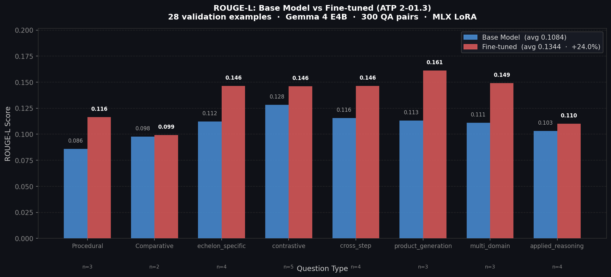

# Fine-tuning Gemma on ATP 2-01.3
### A Step-by-Step Tutorial Using MLX + LoRA and Unsloth + QLoRA

---

## Overview

This project fine-tunes Gemma-family language models on **ATP 2-01.3, Intelligence Preparation of the Battlefield, March 2019** to create an on-device military doctrine assistant for IPB questions, doctrine-grounded answers, and citation-style responses.

Two parallel pipelines are included:

| Notebook | Hardware | Model | Framework | Launch |
|----------|----------|-------|-----------|--------|
| `ATP_Finetune_MLX.ipynb` | Mac Apple Silicon | Gemma 4 E4B, 4-bit | MLX + LoRA | Local notebook |
| `ATP_Finetune_Colab.ipynb` | Google Colab T4 | Gemma 2-2B, 4-bit | Unsloth + QLoRA | [](https://colab.research.google.com/github/Mrhaneul/atp_finetuning/blob/prod/ATP_Finetune_Colab.ipynb) |

### What You'll Build

```text
ATP PDF -> Text Chunks -> QA Seeds -> Gemma Chat Format -> LoRA Training -> ROUGE-L Evaluation -> Optional GGUF Export
```

### Why This Approach?

- **Doctrine-specific behavior** teaches the model IPB terminology, response structure, and ATP citation style.
- **LoRA and QLoRA** keep training small enough for local Apple Silicon or a free Colab T4 GPU.
- **Two hardware paths** let the same doctrine-assistant workflow run locally with MLX or in Colab with Unsloth.
- **ROUGE-L evaluation** compares base-model answers against fine-tuned answers on held-out doctrine questions.

---

## Prerequisites

| Requirement | MLX Pipeline | Colab Pipeline |
|-------------|--------------|----------------|
| Hardware | Apple Silicon Mac | Google Colab T4 GPU |
| Python | 3.11 recommended | Colab runtime |
| Model access | `mlx-community/gemma-4-E4B-it-4bit` | HuggingFace Gemma 2 license accepted |
| Storage | Local project folder | Google Drive folder: `MyDrive/atp-finetuning` |
| Source PDF | `ATP_2-01.3.pdf` | Upload when prompted in Step 2 |

### Before You Start

1. For Colab, enable GPU: Runtime -> Change runtime type -> T4 GPU.
2. Accept the Gemma 2 license at [huggingface.co/google/gemma-2-2b-it](https://huggingface.co/google/gemma-2-2b-it).
3. Have a HuggingFace read token ready for the Colab login cell.
4. Use the `prod` branch when opening the Colab notebook.

---

## Step 0: Clone the Repository

```bash
git clone https://github.com/Mrhaneul/atp_finetuning.git
cd atp_finetuning
git checkout prod
```

---

## Step 1: Run the MLX Pipeline

Use this path on an Apple Silicon Mac.

```bash
conda create -n caimll_finetuning python=3.11 -y
conda activate caimll_finetuning

pip install -r requirements.txt
pip install mlx-lm

python scripts/run_pipeline.py --pdf ATP_2-01.3.pdf
```

To resume from a specific stage:

```bash
python scripts/run_pipeline.py --pdf ATP_2-01.3.pdf --start-from generate
python scripts/run_pipeline.py --start-from train --run-name atp-gemma4-v1
python scripts/run_pipeline.py --start-from eval --adapter outputs/atp-gemma4-v1
```

---

## Step 2: Run the Colab Pipeline

Use this path on Google Colab with a T4 GPU.

1. Open `ATP_Finetune_Colab.ipynb` from the `prod` branch.
2. Run Step 0 to confirm the GPU.
3. Run Step 1 to install Unsloth, training, PDF, and evaluation dependencies.
4. Run Step 2 to mount Google Drive and upload `ATP_2-01.3.pdf`.
5. Run Step 3 to log in to HuggingFace.
6. Run Steps 4-9 to chunk, generate QA seeds, format data, train, evaluate, and plot.

If Step 5 has an old empty or failed seed file, clear it before rerunning:

```python
import os
if os.path.exists(SEEDS_PATH):
    os.remove(SEEDS_PATH)
    print("Cleared")
```

---

## Step 3: Pipeline Outputs

| Stage | Script or Notebook Step | Output |
|-------|--------------------------|--------|
| Chunk PDF | `scripts/chunker.py` or Colab Step 4 | `data/chunks.jsonl` |
| Enrich metadata | `scripts/enricher.py` | `data/enriched.jsonl` |
| Generate QA seeds | `scripts/generator.py` or Colab Step 5 | `data/seeds.jsonl` |
| Format chat data | `scripts/formatter.py` or Colab Step 6 | `data/train.jsonl`, `data/val.jsonl` |
| Train adapter | `mlx_lm lora` or Colab Step 7 | `outputs/<adapter_name>/` |
| Evaluate | `scripts/evaluator.py` or Colab Step 8 | `eval/results.jsonl` |
| Plot | `scripts/plot_eval.py` or Colab Step 9 | `eval/rouge_chart.png` |
| Export | `scripts/burn_gguf.py` or Colab Step 10 | `burns/<model>.gguf` |

---

## Evaluation Results (MLX run)

| Metric | Score |
|--------|-------|
| Base model ROUGE-L | 0.1104 |
| Fine-tuned ROUGE-L | 0.1364 |
| Improvement | **+23.6%** |
| Examples improved | **20 / 28** |



### MLX Results by Question Type

| Question Type | n | Base | Fine-tuned | Delta |
|---------------|---|------|------------|-------|
| Procedural | 3 | 0.0859 | 0.1165 | +0.0306 |
| Comparative | 2 | 0.0977 | 0.0994 | +0.0017 |
| Echelon-Specific | 4 | 0.1122 | 0.1463 | +0.0341 |
| Applied Reasoning | 4 | 0.1031 | 0.1100 | +0.0069 |
| Product Generation | 3 | 0.1131 | 0.1613 | +0.0482 |
| Cross-Step | 4 | 0.1157 | 0.1465 | +0.0308 |
| Multi-Domain | 3 | 0.1112 | 0.1492 | +0.0380 |
| Contrastive | 5 | 0.1284 | 0.1460 | +0.0176 |

---

## Evaluation Results (Colab run)

Colab evaluation is produced by Steps 8-9 after the T4 training run completes.

| Metric | Score |
|--------|-------|
| Base model ROUGE-L | Pending |
| Fine-tuned ROUGE-L | Pending |
| Improvement | Pending |
| Examples improved | Pending |

---

## Troubleshooting

| Issue | Cause | Fix |
|-------|-------|-----|
| Step 5 saves 0 QA pairs | Old failed `seeds.jsonl`, noisy PDF chunks, or format drift in generation | Delete `SEEDS_PATH` and rerun Step 5 on the latest `prod` notebook |
| Step 5 prints many parse failures | Model output did not follow `QUESTION:` / `ANSWER:` format | The notebook now uses deterministic decoding and falls back to extractive QA when parsing fails |
| Colab opens an older notebook | Colab badge or URL points at `main` | Open the notebook from the `prod` branch |
| `GatedRepoError` | Gemma license not accepted | Accept the Gemma 2 license on HuggingFace and rerun login |
| CUDA out of memory | Previous model still in GPU memory | Runtime -> Restart runtime, then resume from the saved Drive step |
| Evaluation file not found | Step 8 has not completed | Run Step 8 before Step 9 |

---

## Performance Notes

| Pipeline | Dataset | Hardware | Expected Time |
|----------|---------|----------|---------------|
| MLX | 255 train / 28 val | Apple Silicon | Completed |
| Colab demo | 50 QA seed target | T4 GPU | Approximately 35-60 minutes |

For higher-quality final results, increase the Colab QA target after the demo run and rerun Steps 5-9.

---

## Project Structure

```text
scripts/
  chunker.py          # PDF to doctrine chunks
  enricher.py         # Metadata classification
  generator.py        # QA generation via Ollama
  formatter.py        # Gemma chat-template formatting
  evaluator.py        # Base vs fine-tuned ROUGE-L evaluation
  plot_eval.py        # Dark theme ROUGE-L chart
  burn_gguf.py        # GGUF export for Ollama
  run_pipeline.py     # Pipeline orchestrator
eval/
  results.jsonl       # Per-example evaluation records
  rouge_chart.png     # Evaluation chart
data/
  train.jsonl         # Formatted training split
  val.jsonl           # Formatted validation split
ATP_Finetune_MLX.ipynb
ATP_Finetune_Colab.ipynb
run_overnight.sh
requirements.txt
RUNBOOK.md
```

---

*This tutorial was developed for the ATP 2-01.3 doctrine assistant fine-tuning pipeline.*
*Fine-tuning paths: MLX + LoRA on Apple Silicon and Unsloth + QLoRA on Google Colab T4.*
